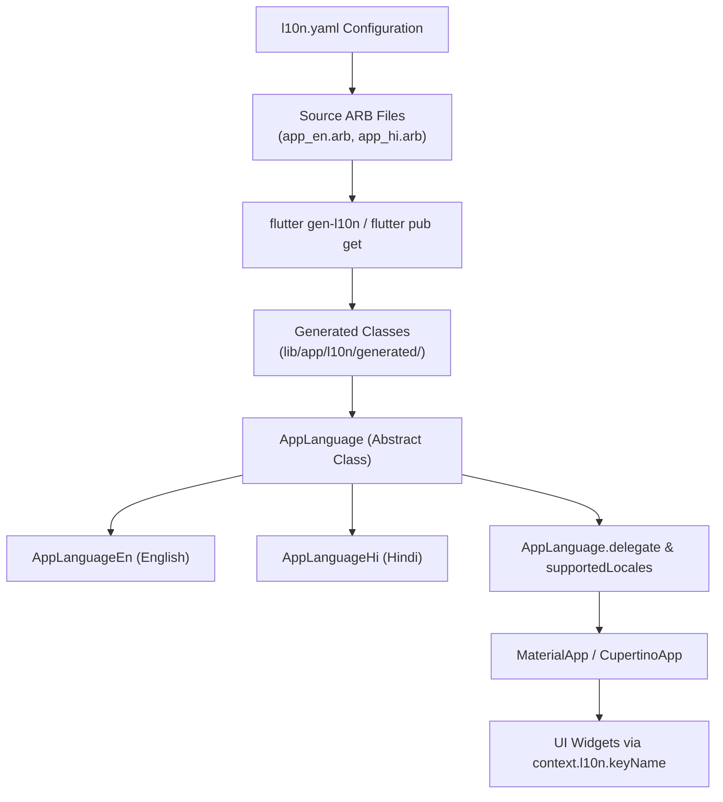

# Flutter Localization (l10n)

This guide covers the **Internationalization (i18n)** and **Localization (l10n)** architecture used in the **Hyyzo** Flutter application. It explains the `l10n.yaml` configuration, ARB file syntax, code generation pipeline, custom extensions, dynamic language switching, and advanced localization patterns.

---

## 1. Quick Overview & Architecture

Hyyzo uses Flutter's official code-generation localization engine (`flutter_localizations` + `gen-l10n`). 



---

## 2. Deep Dive: `l10n.yaml` Configuration

The `l10n.yaml` file at the root of the project configures Flutter's code generation tool (`gen-l10n`).

```yaml
arb-dir: lib/app/l10n
template-arb-file: app_en.arb
output-localization-file: app_localizations.dart
output-dir: lib/app/l10n/generated
nullable-getter: false
output-class: AppLanguage
untranslated-messages-file: l10n_errors.txt
```

### Parameter Breakdown

| Parameter | Value | What It Does & Why It Is Used |
| :--- | :--- | :--- |
| **`arb-dir`** | `lib/app/l10n` | The directory where your `.arb` (Application Resource Bundle) translation files live. |
| **`template-arb-file`** | `app_en.arb` | The primary template translation file (English). Flutter uses this as the base schema for all keys, types, and placeholders. |
| **`output-localization-file`** | `app_localizations.dart` | The name of the primary generated Dart file containing delegate and entrypoint classes. |
| **`output-dir`** | `lib/app/l10n/generated` | The custom target folder where all generated Dart files (`app_localizations.dart`, `app_localizations_en.dart`, `app_localizations_hi.dart`) are written. *(Default is `.dart_tool/flutter_gen`, but Hyyzo outputs directly into `lib/` for direct inspection and type-safety).* |
| **`nullable-getter`** | `false` | When set to `false`, `AppLanguage.of(context)` returns `AppLanguage` (non-nullable) instead of `AppLanguage?`. This eliminates the need for `!` force unwrapping everywhere in the UI. |
| **`output-class`** | `AppLanguage` | Renames the default generated class from `AppLocalizations` to `AppLanguage`, providing clean, expressive syntax like `AppLanguage.of(context).appName`. |
| **`untranslated-messages-file`**| `l10n_errors.txt` | Automatically writes a log file listing any keys present in the template file (`app_en.arb`) that are missing in other language files (e.g., `app_hi.arb`). |

---

## 3. ARB File Syntax (Zero to Advanced)

ARB (Application Resource Bundle) files are JSON-based files with special metadata keys prefixed by `@`.

### 3.1 Basic String Translation
```json
{
  "@@locale": "en",
  "appName": "Hyyzo",
  "@appName": {
    "description": "The main application brand name"
  },
  "noCodeRequired": "No Code Required",
  "@noCodeRequired": {
    "description": "Text shown when no coupon code is needed"
  }
}
```

---

### 3.2 Dynamic Placeholders (String, Numbers, Dates)

Placeholders let you inject dynamic variables into localized strings.

#### Single String Parameter
```json
"codeCopied": "Code {code} copied to clipboard!",
"@codeCopied": {
  "description": "Toast message shown when coupon code is copied",
  "placeholders": {
    "code": {
      "type": "String",
      "example": "HYYZO50"
    }
  }
}
```

#### Integer Parameter with Formatting
```json
"availableCoupons": "Available Coupons ({count})",
"@availableCoupons": {
  "description": "Header title showing total available coupons",
  "placeholders": {
    "count": {
      "type": "int",
      "format": "compact",
      "example": "12"
    }
  }
}
```

#### Currency & Decimal Formatting
```json
"cashbackEarned": "You earned {amount} cashback",
"@cashbackEarned": {
  "description": "Cashback amount message",
  "placeholders": {
    "amount": {
      "type": "double",
      "format": "currency",
      "optionalParameters": {
        "symbol": "₹",
        "decimalDigits": 2
      }
    }
  }
}
```

#### Date & Time Formatting
```json
"orderDate": "Ordered on {date}",
"@orderDate": {
  "description": "Order placement date",
  "placeholders": {
    "date": {
      "type": "DateTime",
      "format": "yMMMd"
    }
  }
}
```

---

### 3.3 Advanced Pluralization (`plural`)

Handles singular and plural variations based on language rules:

```json
"referralCount": "{count, plural, =0{No friends invited yet} =1{1 friend invited} other{{count} friends invited}}",
"@referralCount": {
  "description": "Number of invited friends",
  "placeholders": {
    "count": {
      "type": "num",
      "format": "compact"
    }
  }
}
```

---

### 3.4 Advanced Gender / Enum Branching (`select`)

Handles conditional phrasing based on enums, status, or gender:

```json
"cashbackStatusMessage": "{status, select, pending{Your cashback is pending verification} approved{Your cashback is approved!} rejected{Your cashback was rejected} other{Status unknown}}",
"@cashbackStatusMessage": {
  "description": "Dynamic cashback status description",
  "placeholders": {
    "status": {
      "type": "String"
    }
  }
}
```

---

## 4. Generated Code Structure

Running `flutter gen-l10n` generates the following files inside `lib/app/l10n/generated/`:

### 4.1 `app_localizations.dart`
The main entry point containing:
- `abstract class AppLanguage`: Base class defining all translation getters and methods.
- `AppLanguage.of(BuildContext context)`: Resolves the inherited `AppLanguage` instance.
- `AppLanguage.delegate`: `LocalizationsDelegate<AppLanguage>` required by `MaterialApp`.
- `AppLanguage.supportedLocales`: List of supported `Locale` objects (e.g., `[Locale('en'), Locale('hi')]`).
- `AppLanguage.localizationsDelegates`: Combined list of delegates (`AppLanguage.delegate`, `GlobalMaterialLocalizations.delegate`, `GlobalWidgetsLocalizations.delegate`, `GlobalCupertinoLocalizations.delegate`).

### 4.2 `app_localizations_en.dart`
Contains the English implementation class:
```dart
class AppLanguageEn extends AppLanguage {
  AppLanguageEn([String locale = 'en']) : super(locale);

  @override
  String get appName => 'Hyyzo';

  @override
  String codeCopied(String code) {
    return 'Code $code copied to clipboard!';
  }
}
```

### 4.3 `app_localizations_hi.dart`
Contains the Hindi implementation class:
```dart
class AppLanguageHi extends AppLanguage {
  AppLanguageHi([String locale = 'hi']) : super(locale);

  @override
  String get appName => 'हायज़ो';

  @override
  String codeCopied(String code) {
    return 'कोड $code क्लिपबोर्ड पर कॉपी हो गया!';
  }
}
```

---

## 5. Integration in `MaterialApp`

In `lib/main.dart`, configure the delegates and supported locales on `MaterialApp`:

```dart
import 'package:flutter/material.dart';
import 'package:hyyzo/app/l10n/generated/app_localizations.dart';

class HyyzoApp extends StatelessWidget {
  final Locale? currentLocale; // e.g. Locale('en') or Locale('hi')

  const HyyzoApp({super.key, this.currentLocale});

  @override
  Widget build(BuildContext context) {
    return MaterialApp(
      title: 'Hyyzo',
      locale: currentLocale, // Dynamic locale
      localizationsDelegates: AppLanguage.localizationsDelegates,
      supportedLocales: AppLanguage.supportedLocales,
      home: const HomePage(),
    );
  }
}
```

---

## 6. Developer Experience: BuildContext Extension

To avoid writing `AppLanguage.of(context)` everywhere, Hyyzo uses a concise Dart extension located at:  
[`lib/core/utils/dependency_utils/app_localization_extension.dart`](file:///c:/Users/Flipshope%20User/Documents/GitHub/hyyzo_flutter/lib/core/utils/dependency_utils/app_localization_extension.dart)

```dart
import 'package:flutter/widgets.dart';
import '../../../app/l10n/generated/app_localizations.dart';

extension AppLocalizationExtension on BuildContext {
  AppLanguage get l10n => AppLanguage.of(this);
}
```

### Usage in Widgets:

```dart
class StoreCouponWidget extends StatelessWidget {
  final String couponCode;
  final int count;

  const StoreCouponWidget({
    super.key,
    required this.couponCode,
    required this.count,
  });

  @override
  Widget build(BuildContext context) {
    return Column(
      children: [
        // Simple string
        Text(context.l10n.noCodeRequired),

        // Parameterized integer
        Text(context.l10n.availableCoupons(count)),

        // Parameterized string
        ElevatedButton(
          onPressed: () {
            Fluttertoast.showToast(msg: context.l10n.codeCopied(couponCode));
          },
          child: Text(context.l10n.copyCode),
        ),
      ],
    );
  }
}
```

---

## 7. Using Localization Outside BuildContext (BLoCs / Controllers / Helpers)

When helper classes, BLoCs, or background services need localized text without a direct `BuildContext`, pass the `AppLanguage` instance directly:

```dart
class CashbackStatusHelper {
  static String getStatusLabel({
    required String status,
    required AppLanguage language,
  }) {
    switch (status.toLowerCase()) {
      case 'tracked':
        return language.cashbackTracked;
      case 'confirmed':
        return language.cashbackConfirmed;
      case 'paid':
        return language.cashbackPaid;
      default:
        return language.cashbackPending;
    }
  }
}
```

---

## 8. Untranslated Key Auditing (`l10n_errors.txt`)

Because `untranslated-messages-file: l10n_errors.txt` is enabled in `l10n.yaml`:

1. Whenever you run `flutter gen-l10n` or build the app, Flutter compares `app_hi.arb` against the master `app_en.arb`.
2. Any untranslated key is automatically appended to `l10n_errors.txt`.
3. If a translation is missing in Hindi, Flutter falls back gracefully to the English translation at runtime without crashing.

---

## 9. Dynamic Language Switching (English $\leftrightarrow$ Hindi)

To change the app language dynamically at runtime without restarting the app:

### Step 1: Locale BLoC / Cubit
```dart
class LocaleCubit extends HydratedCubit<Locale> {
  LocaleCubit() : super(const Locale('en'));

  void changeLanguage(String languageCode) {
    emit(Locale(languageCode));
  }

  @override
  Locale? fromJson(Map<String, dynamic> json) {
    return Locale(json['languageCode'] as String? ?? 'en');
  }

  @override
  Map<String, dynamic>? toJson(Locale state) {
    return {'languageCode': state.languageCode};
  }
}
```

### Step 2: Language Selector Widget
```dart
class LanguageSwitcherSheet extends StatelessWidget {
  const LanguageSwitcherSheet({super.key});

  @override
  Widget build(BuildContext context) {
    return Column(
      mainAxisSize: MainAxisSize.min,
      children: [
        ListTile(
          title: const Text('English'),
          trailing: Localizations.localeOf(context).languageCode == 'en'
              ? const Icon(Icons.check, color: Colors.green)
              : null,
          onTap: () {
            context.read<LocaleCubit>().changeLanguage('en');
            Navigator.pop(context);
          },
        ),
        ListTile(
          title: const Text('हिंदी (Hindi)'),
          trailing: Localizations.localeOf(context).languageCode == 'hi'
              ? const Icon(Icons.check, color: Colors.green)
              : null,
          onTap: () {
            context.read<LocaleCubit>().changeLanguage('hi');
            Navigator.pop(context);
          },
        ),
      ],
    );
  }
}
```

---

## 10. CLI Commands & Workflow

| Task | Command |
| :--- | :--- |
| **Generate Localizations** | `flutter gen-l10n` |
| **Auto-generate on Pub Get** | `flutter pub get` *(Runs gen-l10n automatically when `generate: true` is in `pubspec.yaml`)* |
| **Check Missing Translations** | Inspect `l10n_errors.txt` |
| **Add a New Language (e.g. Tamil)** | 1. Create `lib/app/l10n/app_ta.arb`<br/>2. Add `"@@locale": "ta"`<br/>3. Run `flutter gen-l10n` |

---

## 11. Best Practices & Rules

1. **Never Hardcode User-Facing Text**: Always add UI strings to `app_en.arb` first.
2. **Always Provide Descriptions**: Add `@key` description metadata in `app_en.arb` to provide translators with context.
3. **Use Types on Placeholders**: Specify `"type": "String"` or `"type": "int"` in ARB files to ensure strong Dart typing.
4. **Keep ARB Valid JSON**: Do not use trailing commas in ARB files as JSON standard will throw parse errors.
5. **Use `context.l10n`**: Always prefer the extension syntax `context.l10n.myString` over `AppLanguage.of(context).myString`.
